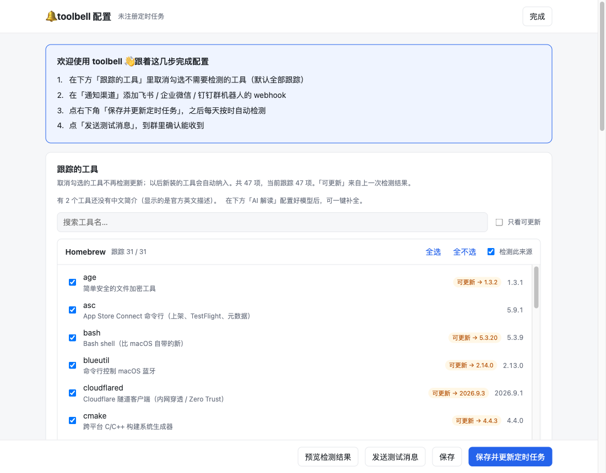
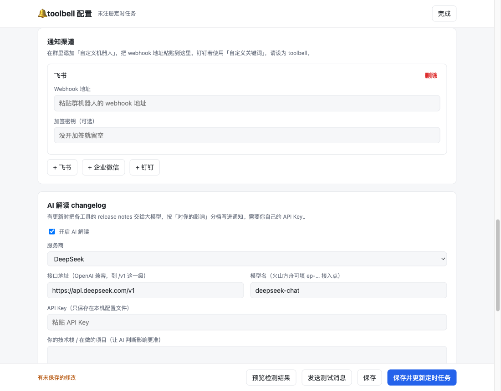

# toolbell 🔔

[](https://github.com/52216108/toolbell/actions/workflows/ci.yml)
[](https://github.com/52216108/toolbell/releases)
[](LICENSE)

**简体中文** | [English](README.en.md)

> 你的开发工具有新版了，它会告诉你。

toolbell 会自动扫描你电脑上**主动安装**的开发工具（Homebrew、npm / pnpm 全局包、uv、pipx、cargo、GitHub Release 二进制、本地 git 克隆、Claude Code 插件……），每天定时检测有没有新版本，推送到**飞书 / 企业微信 / 钉钉**群机器人。可选接入大模型，把一堆 changelog 读成「哪些对你真正有影响」。

- **只提醒，不自动升级**：升级可能连带改动运行时（例如 brew 升级某个包时顺带升级 ruby，导致项目里的原生扩展失效），什么时候升由你决定。消息里会直接给出升级命令。
- **装完自动发现**：不用手写清单。只看你主动装的（`brew leaves`），不把依赖库算进来刷屏；以后新装的工具自动纳入。
- **国内办公 IM 原生支持**：飞书、企业微信、钉钉，含飞书/钉钉加签。
- **网页可视化配置**：`toolbell ui` 打开本地网页，勾选要跟踪的工具（每个工具附中文简介）、配置渠道和 AI，一目了然。
- **AI 解读 changelog（可选）**：自带 Key，支持任何 OpenAI 兼容接口（DeepSeek、火山方舟/豆包、通义千问、OpenAI、OpenRouter…）。一次跨好几个版本时，会拉取区间内**全部** release notes，而不是只看首尾两版。

## 配置网页

运行 `toolbell` 打开本地配置页：每个工具附中文简介，勾选要跟踪的即可；渠道、AI、定时都在同一页完成。





## 推送效果

每天定时检测，有可更新的工具时往群里推送一条消息（全部最新时默认不打扰）：

```text
🔔 toolbell 更新提醒 · my-mac · 2026-10-03 09:30

⚠️ 有 3 项可更新

Homebrew
- gh 2.96.0 → 2.102.0
  brew upgrade gh
- asc 5.1.0 → 5.9.1
  brew upgrade asc

npm 全局包
- eas-cli 20.3.0 → 24.8.0
  npm i -g eas-cli@latest

✅ 其余 45 项已是最新

AI 影响评估（开启后附在末尾）
一句话总结：asc 跨 8 个版本，含命令输出字段变化，上架脚本需要核对……
```

## 系统要求

- macOS（launchd 定时）或 Linux（crontab 定时）；暂不支持 Windows
- Node.js ≥ 20

## 快速开始

```bash
npm i -g https://github.com/52216108/toolbell/releases/latest/download/toolbell.tgz
toolbell
```

首次运行会自动打开本地配置网页，跟着页面顶部的引导走：

1. 在「跟踪的工具」里取消勾选不需要检测的（每个工具都附中文简介，默认全部跟踪）；
2. 在「通知渠道」填飞书 / 企业微信 / 钉钉群机器人的 webhook；
3. 点「保存并更新定时任务」，之后每天按时自动检测；
4. 点「发送测试消息」，到群里确认能收到。

以后想改配置，运行 `toolbell ui` 重新打开网页。

### 让 AI Agent 帮你装

也可以把下面这段话复制给你的 AI 编程助手（Claude Code、Codex、Cursor 等）：

```text
请帮我安装 toolbell（https://github.com/52216108/toolbell），一个检测本机开发工具更新、推送到飞书/企业微信/钉钉的工具：
1. 运行 node -v 确认 Node.js ≥ 20（只支持 macOS 和 Linux），不满足就停下告诉我。
2. 运行 npm i -g https://github.com/52216108/toolbell/releases/latest/download/toolbell.tgz 安装，再用 toolbell --version 确认。
3. 在后台运行 toolbell ui（它会一直运行，直到我在网页上点「完成」）。macOS 会自动打开浏览器；如果没打开，把输出里的网址发给我。告诉我在网页里按顶部引导完成配置。
4. 我说配置好了以后，运行 toolbell status 给我汇总结果。
注意：不要在对话里向我索要 webhook 或 API Key，这些我会自己在网页里填；也不要替我执行任何升级命令。
```

> 没有浏览器的环境（例如远程服务器），可以用 `toolbell init` 终端向导，或下方「命令行参考」里的非交互命令完成配置。

### 升级与卸载

```bash
# 升级：重新安装即可，配置保留（--prefer-online 避免 npm 按地址缓存、装回旧版本）
npm i -g --prefer-online https://github.com/52216108/toolbell/releases/latest/download/toolbell.tgz

# 卸载：先取消定时任务，再删除程序（配置在 ~/.config/toolbell，按需自行删除）
toolbell schedule --off
npm rm -g toolbell
```

## 命令行参考

日常用网页就够了；下面的命令适合写脚本、远程服务器或喜欢命令行的场景。

| 命令 | 作用 |
|---|---|
| `toolbell` | 未配置时打开网页配置；已配置时显示状态 |
| `toolbell ui` | 打开本地网页，可视化配置（勾选工具、渠道、AI、定时）；Linux 下默认只打印地址，加 `--open` 自动打开 |
| `toolbell init` | 终端交互式配置向导 |
| `toolbell check` | 立即检测一次，有更新就推送 |
| `toolbell check --dry-run` | 只在终端预览：不刷新索引、不 git fetch、不推送（开启 AI 解读时仍会调用一次模型） |
| `toolbell list` | 列出发现的工具及是否被跟踪 |
| `toolbell ignore brew:cocoapods` | 不再跟踪某个工具（key 见 `list`） |
| `toolbell unignore brew:cocoapods` | 恢复跟踪 |
| `toolbell schedule 08:45` | 修改每天检测时间；`--off` 取消 |
| `toolbell test-notify` | 真实检测一次并强制推送，确认渠道可用 |
| `toolbell status` | 查看定时任务与最近一次结果 |
| `toolbell channel add feishu <webhook> [--secret …]` | 添加通知渠道（`channel list` / `channel remove` 管理） |
| `toolbell ai set --provider deepseek --model …` | 设置 AI 接口与模型；`toolbell ai key` 在终端输入 Key；`ai off` 关闭 |
| `toolbell repo add ~/some-repo` | 跟踪本地 clone 的仓库（只检测不 pull） |
| `toolbell release add <名称> --repo owner/repo --version-cmd "…"` | 跟踪直接下载 GitHub Release 的工具 |

## 支持的来源

| 来源 | 如何发现 | 如何判断新版 |
|---|---|---|
| Homebrew formula | `brew leaves --installed-on-request` | 先 `brew update` 刷新索引再比对（处理 `_N` 修订号） |
| Homebrew cask | `brew info --installed` | 跳过 `auto_updates` 的 App（它们自己会更新） |
| npm 全局包 | `npm ls -g` | `npm outdated -g` |
| pnpm 全局包 | `pnpm ls -g` | npm registry |
| uv tool | `uv tool list` | `uv tool list --outdated` |
| pipx | `pipx list --json` | PyPI |
| cargo | `cargo install --list` | crates.io |
| Git 仓库 | 手动登记（`repo add`、网页或 `init`） | `git fetch` 后比较上游，**从不 pull** |
| GitHub Release 二进制 | 手动登记（`release add` 或网页） | GitHub latest release |
| Claude Code 插件 | `~/.claude/plugins` | 按声明版本号判断（未发版的提交不提醒） |

### 登记 GitHub Release 二进制

直接下载 release 的工具没法自动识别，需要登记（也可以在 `toolbell ui` 网页里添加）：

```bash
toolbell release add multica --repo multica-ai/multica --version-cmd "multica --version" --update-cmd "multica update"
```

等价于在 `~/.config/toolbell/config.json` 里加：

```json
"githubReleases": [
  { "name": "multica", "repo": "multica-ai/multica", "versionCommand": "multica --version", "updateCommand": "multica update" }
]
```

`versionCommand` 输出里的第一个 `x.y.z` 会被当成本机版本。

## 通知渠道配置

在群里添加「自定义机器人」，把 webhook 地址填进 `toolbell ui` 网页，或执行 `toolbell channel add <feishu|wecom|dingtalk> <webhook> [--secret <密钥>]`：

- **飞书**：群设置 → 群机器人 → 添加机器人 → 自定义机器人。建议开启「签名校验」，并填上密钥。
- **企业微信**：群聊 → 添加群机器人 → 新创建机器人。
- **钉钉**：群设置 → 机器人 → 自定义。安全设置选「加签」并填上密钥；若选「自定义关键词」，请把关键词设为 `toolbell`（每条消息标题都带这个词）。

> 企业微信单条 markdown 上限 4096 字节，开启 AI 解读时评估内容会被截断，完整内容建议用飞书或钉钉接收。

## 工具简介

列表里每个工具都附一句简介，帮你判断要不要跟踪：

1. 常见工具内置中文简介（离线可用）；
2. 其余显示包管理器自带的官方英文描述；
3. 配置了 AI 后，可在网页里一键「用 AI 补全中文简介」，结果缓存在本机，只依据官方描述生成，不凭名字猜。

欢迎提 PR 补充 `src/describe/dict-zh.ts` 里的中文简介。

## 隐私与安全

- 配置保存在 `~/.config/toolbell/config.json`（权限 600），webhook、加签密钥、API Key 只存在本机。
- `toolbell ui` 只监听 127.0.0.1，链接带每次启动随机生成的 token，并校验 Host 头；已保存的 webhook、密钥、Key 不会回传到网页。
- 发往通知渠道的内容：主机名、工具名、版本号、升级命令、检测失败原因，开启 AI 时还有影响评估。
- 开启 AI 解读时，可更新工具的名称、版本、changelog 原文和你填写的自我介绍会发给你配置的模型服务；「用 AI 补全中文简介」会发送工具名与官方英文描述。
- 访问 GitHub 时优先用 `GITHUB_TOKEN` / `GH_TOKEN` 或 `gh auth token`，没有就匿名访问（每小时 60 次）。

## 常见问题

**定时任务没推送？** 先运行 `toolbell status` 看定时任务是否注册、最近一次结果；详细日志在 `~/.config/toolbell/toolbell.log`。

**新装了包管理器（例如 cargo、pipx），定时检测里却没有它？** 定时任务的 PATH、代理等环境变量是在注册时从当前终端记录下来的。装完新工具后重新运行一次 `toolbell schedule` 即可。

**用了代理 / 镜像源？** 注册定时任务时会一并记录 `HTTP(S)_PROXY`、`HOMEBREW_*` 镜像等变量（名字里带 TOKEN / KEY 等疑似密钥的不会记录）。换了代理地址后同样重新运行 `toolbell schedule`。

**某个工具不想再收到提醒？** `toolbell ignore <key>`，或在 `toolbell ui` 网页里取消勾选。整个来源都不想要，可以在网页里关闭「检测此来源」。

## 参与贡献

开发环境、目录结构、新增检测来源、发布流程见 [CONTRIBUTING.md](CONTRIBUTING.md)；安全问题请按 [SECURITY.md](SECURITY.md) 私密报告。

## License

[MIT](LICENSE)
